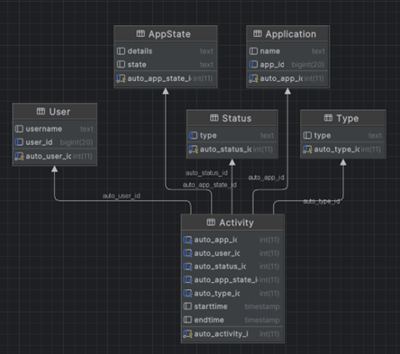
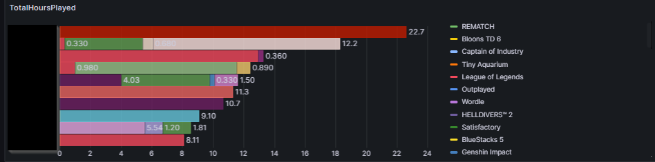
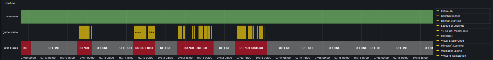
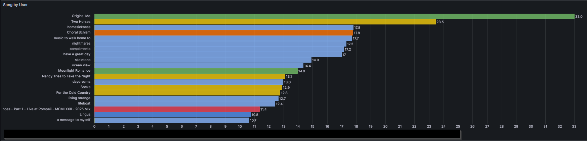
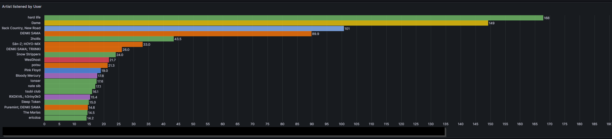
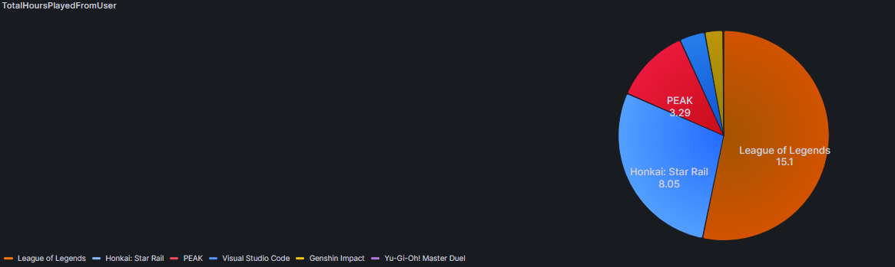
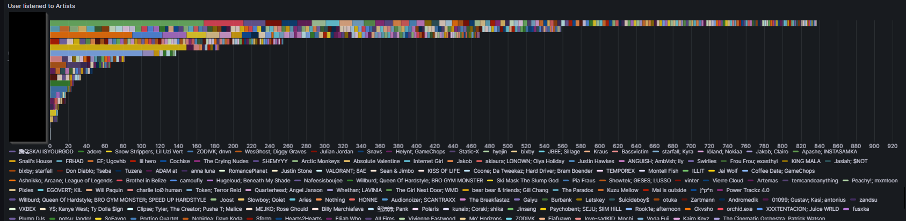
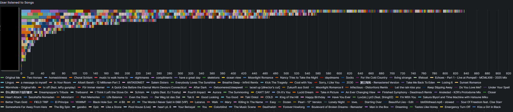

# Discord Activity Logger Bot

A modular and extensible Discord bot built in Java for logging, storing, and visualizing user activity using Discord4J, MariaDB, and Grafana.

---


## Project Overview

Key components of the system:

- Track Discord user activities (status, games, Spotify)
- Persist data in a relational MariaDB database
- Visualize aggregated data through Grafana dashboards
- Enable user interaction via slash commands and Discord buttons

## Tech Stack

| Technology       | Purpose                            |
|------------------|-------------------------------------|
| Java             | Backend logic                      |
| Discord4J        | Discord API binding                |
| MariaDB          | Relational database                |
| Grafana          | Data visualization dashboards      |
| Docker/Portainer | Deployment and container orchestration |

## Features

- Tracks user presence states (online, idle, DND)
- Logs game and Spotify usage data including duration and titles
- Stores activity entries with high precision using start and end timestamps
- Real-time Grafana dashboards showing user behavior
- Interactive components in Discord (buttons, slash commands)
- Optimized for multi-user, multi-server scenarios

## ERD (Database Structure)

The following diagram shows how the entities such as users, activities, statuses, and applications are related:



## Sample Dashboards

Below is a showcase of visualizations generated from the data using Grafana:

### Total Hours Played (All Users)
Displays how many hours each user spent playing tracked games.



### Timeline View of User Presence
Visualizes user status changes (online, idle, DND) over time.



### Spotify Listening Time per User
Shows the total listening time per song and user.



### Artist Listening Time per User
Displays which artists were listened to most by each user.



### Pie Chart – Total Hours by Game (Per User)
Visual representation of how a user's total gaming time is distributed.



### User-to-Artist Breakdown
Matrix-style chart showing how long each user listened to each artist.



### User-to-Song Breakdown
Matrix-style chart showing which songs users listened to and for how long.



## Setup (Docker Compose)

```yaml
version: '3.8'
services:
  bot:
    build: .
    environment:
      - DISCORD_CLIENT_TOKEN
      - DB_HOST 
      - DB_USERNAME
      - DB_PASSWORD
    depends_on:
      - mariadb
    restart: unless-stopped

  mariadb:
    image: mariadb
    environment:
      - MYSQL_ROOT_PASSWORD
      - MYSQL_DATABASE
    volumes:
      - ./db-data:/var/lib/mysql

  grafana:
    image: grafana/grafana
    ports:
      - "3000:3000"
    volumes:
      - ./grafana:/var/lib/grafana
