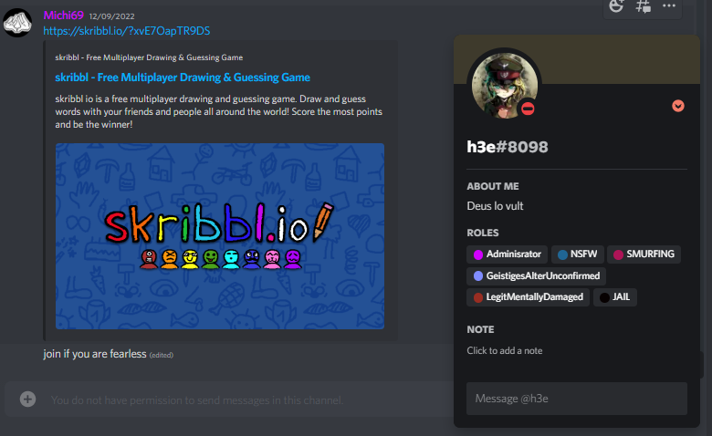

<p align="center">
  <a href="https://example.com/">
    
  </a>

<h3 align="center">Suguha Kirigaya</h3>
  <h3 align="center">Discord Bot</h3>

<p align="center">
    Discord Bot für Administration eines Discord Servers<br>
    Marvin Huber, Mario Weilenmann
    <br>
    <a href="https://reponame/issues/new?template=bug.md">Report bug</a>
    ·
    <a href="https://reponame/issues/new?template=feature.md&labels=feature">Request feature</a>
  </p>


# Inhaltsverzeichnis
- [Management Summary](#management-summary)
- [Einleitung](#einleitung)
- [Dokumentation](#dokumentation)
- [Aufgabenstellung](#aufgabenstellung)
- [Idee](#idee)
- [Projektziele](#projektziele)
- [Risikoanalyse](#risikoanalyse)
- [Meilensteine](#meilensteine)
- [Einrichtung und Konfiguration](#einrichtung-und-konfiguration)
- [Features](#features)
- [Technische Doku](#technische-doku)
- [Testing](#testing)

# Management Summary

## Einleitung

Im Modul Projektmanagement haben wir die Aufgabe, ein Projekt zu absolvieren.
In diesem Dokument wir die Aufgabe erklärt sowie unsere Idee und die zu verwendeten Techologien erläutert. 
Ausserdem werden die Rahmenbedingungen festgehalten.

## Hintergrund

Ein grosser Discord-server ist mit grossem Verwaltungsaufwand verbunden.
Mit einem Discord bot wollen wir Aufgaben automatisieren und den Zeitaufwand verkleinern.

## Funktion

Suguha Kirigaya ist ein Discord Bot. Der Bot kann mit verschiedenen Befehlen Interagieren und automatisiert Rollen verteilen. 
Als eine erweiterbare Infrastruktur können Funktionen einfach hinzugefügt und erweitert werden.

## Reflexion

Die Projektarbeit bietet eine gute, erweiterbare Grundstruktur. Diese ermöglicht uns, den Bot einfach und gezielt zu erweitern.
Der Arbeitsaufwand des Servers wurde spürbar verkleinert.
Durch dieses Projekt konnten wir unser Wissen über Java erweitern.

# Dokumentation
## Aufgabenstellung

Unsere Aufgabe ist es, eine Projektarbeit in der Programmiersprache JAVA zu machen.

## Idee

Die Idee ist es, ein Tool zu entwickeln, welches die Administration eines grossen Discord Servers erleichtert.
Dieses Soll erweiterbar sein und somit eine Lernplattform bilden, um uns zu unterstützen während der Schulzeit.
Implementierung neuer Features oder Erweiterung der alten soll uns beim lernen der Programmiersprache JAVA ein Ansatz bieten.

## Projektziele

Durch Automatisation und Implementation von Tasks und Features (Rollenverteilung, Channelmanagement) soll der Verwaltungsaufwand des Discord Servers verringert werden.

Mit diesem Projekt sollen folgende Ziele erreicht werden:

- 1. Automatisation von Rollenverteilung
- 2. Individuelle Befehle (Ping - Pong)
- 3. Aufbau der Infrastruktur für eine erweiterbare Lernumgebung

## Risikoanalyse


| Schadensausmass |                                                                                                 |        |      |
| :-------------- | :---------------------------------------------------------------------------------------------- | -----: | ---: |
| Hoch            | -Discord stellt keine Dienste<br />mehr bereit <br />-Java wird nicht weiter<br /> unterstützt  |        |      |
| Mittel          |                                                                                                 |        |      |
| Niedrig         |                                                                                                 |        |      |
|                 | Niedrig                                                                                         | Mittel | Hoch |
|                 | __Eintrittswarscheinlichkeit__                                                                  |        |      |

# Meilensteine

## Chart


| Meilenstein                  | Festgelegter Termin | Fertigstellung |
| ---------------------------- | ------------------- | -------------- |
| Projektbeginn                | 29.04.2022          |                |
| Projektantrag Abgabe         | 07.05.2022          | 07.05.2022     |
| Infrastruktur bereitgestellt | 27.05.2022          | 30.07.2022     |
| Abgabe Projektarbeit         | 17.09.2022          | 16.09.2022     |
| Projektabschluss             | 02.09.2022          |                |

## Termine


| Sitzungen        | Termine                |
| ---------------- | ---------------------- |
| Projektsitzungen | 03.06.2022, 29.08.2022 |
| Präsentation    | 23.09.2022/30.09.2022  |

# Einrichtung und Konfiguration

## Raspberry PI Einrichtung

Für den Discord Bot benötigen wir einen Host. Wir haben uns hier für ein Raspberry PI entschieden, da dieses einfach zu warten ist und wenig Platz benötigt.<br />

Mit Hilfe von Raspberry PI Imager kann das gewünschte Betriebssystem installiert werden. Wir verwenden das PI OS 64-bit und schreiben dieses auf die Micro SD Karte.
Bei erfolgreichem schreiben des Betriebssystems können wir die SD Karte einsetzen und mit einem USB-C den Raspberry Pi Computer mit Strom versorgen.

## Raspberry Konfiguration

Mittels HDMI können wir den Desktop des Betriebssystem anzeigen lassen und die ersten Konfigurationen vornehmen. <br />

Mittels Setupmanager wählen wir als erstes die korrekte Region, Zeitzone und Sprache. Danach setzen wir ein Passwort sowie den Namen für den User. Wir benennen ihn nach unserem Projekt, also sugu. Wir benötigen den Namen und Passwort später, wenn wir via SSH darauf zugreifen wollen. <br />

Wir setzen den Haken für das Screen Setup um optimierte Auflösungen zu erhalten für den Bildschirm. Da wir Ethernet verwenden, müssen wir uns nicht mit einem W-LAN verbinden. <br />

Sobald wir mit einem Netzwerk verbunden sind, können wir im Setupmanager ein Update der Software durchführen.

## SSH einschalten

Um auf unseren User zugreifen zu können, müssen wir SSH aktivieren. Dafür klicken wir auf dem Desktop auf das Raspberry logo, wählen **Preferences** und dann **Raspberry PI Configuration**. Unter dem **Interfaces** Tab können wir SSH anwählen.

  <br />

## Statische IP vergeben

Um mit keinen Komplikationen konfrontiert zu werden, vergeben wir dem Raspberry PI eine Statische IP Addresse. Dafür öffnen wir das Terminal auf dem Desktop. Mittels ``ifconfig`` können wir die momentan zugeweiste IP des netzwerkes ansehen. In unserem Fall ist dies **192.168.1.17**.<br />Mittels ``sudo nano /etc/dhcpcd.conf`` können wir direkt in die config file unsere gewünschte IP Addresse schreiben. Dies machen wir wiefolgt:

```
interface eth0
static ip_address=192.168.1.17
static routers=192.168.1.1
static domain_name_servers=8.8.8.8 8.8.4.4

```

Einstellungen mit ``Ctrl + o`` schreiben und den Editor mit ``Ctrl + x`` verlassen. Danach den Raspi neustarten:

``sudo reboot``

## Docker Installation

Mit Docker ist es einfach, Server-Software Auszuprobieren und zu Betreiben. So Installiert man die Container-Plattform für gängige Betriebssysteme auf dem Server oder Entwickler-PC, hier in unserem Fall das Raspberry PI.

Da nun eine Statische IP gesetzt wurde, kann via SSH verbunden werden. Mittels dem Programm Putty auf 192.168.1.17 verbinden, Username und Passwort eingeben. <br />
Danach führen wir standart package updates aus, um auf dem neusten stand zu sein.

```
sudo apt update

sudo apt upgrade
```

Mit dem curl statement starten wir ein Shell Script, um Docker zu installieren:

```
curl -sSL https://get.docker.com | sh
```

Als nächstes müssen wir den Benutzer ```sugu``` in die dockergruppe hinzufügen:

```
sudo usermod -aG docker sugu
```

## Docker testen

Nach der Installation von Docker und Docker-Compose kann man Programme schnell auf allen Betriebssystemen testen. Ob der Docker-Daemon läuft, verrät `docker version`.

Ob Docker-Compose läuft, verrät `docker compose version`.

## Portainer Installation

Um die Verwaltung der Container zu vereinfachen mit einem web GUI installieren wir Portainer.
Portainer ist ein Open Source Werkzeug, um Container basierte Anwendungen unter Docker, Kubernetes, Docker Swarm und Azure ACI zu verwalten. Dabei stellt Portainer eine komfortable Benutzeroberfläche für das Management der Docker-Umgebung zur Verfügung.

```
sudo docker pull portainer/portainer-ce:linux-arm

sudo docker run -d -p 9000:9000 --name=portainer --restart=always -v /var/run/docker.sock:/var/run/docker.sock -v portainer_data:/data portainer/portainer-ce:linux-arm
```

Danach ist die Installation abgeschlossen. Nun können wir mit einem Browser Lokal auf das Webinterface zugreifen: ``http://sugu.local:9000/``

 


## Discord Übersicht

Discord ist eine App für Nachrichten, Chats und Videoanrufe.
Das Programm kann auf dem Smartphone oder auch auf dem PC installiert werden.

In den Chats lassen sich auch Videos, Bilder oder Dokumente versenden.
Auf Discord kann man auch eigene Server erstellen. Server sind Bereiche, in denen man sich mit Freunden oder anderen Usern zu einem speziellen Thema austauschen kann.
Auf einem Server kann man verschiedene Sprach- und Textkanäle mit verschiedenen Berechtigungen erstellen. Diese Berechtigungen werden über Rollen verwaltet und können den Usern zugewiesen werden.


# Features

## Rollenverteilung "Simp" Rolle

Um auf einem grossen Server zu erkennen, welcher User zu welcher Freundesgruppe gehört, ist es praktisch einer Rollengruppe anzugehören.
Immer dann, wenn ein Benutzer sich mit dem Sprachkanal "Katari`s Simpsumpf" verbindet, wird dem User über das ausgelöste Event die Rolle "Simp" zugewiesen.
Dadurch ist

## Ping - Pong

Um zu Überprüfen ob der Discord Bot funktioniert und läuft, wird eine Ping - Pong Funktion eingebaut.
Mit `/Ping` kann ein Event ausgelöst werden. Dieses wird mit der Reaktion "Pong!" beantwortet im Chat vom Discord Bot. Somit weiss man, dass er Online ist und funktioniert.

## @Everyone Bot Schutz und Jail Rollenvergabe

Der Chatbefehl `@everyone` wird häufig von Scam-Bots verwendet, um die Aufmerksamkeit durch einen ping an alle zu erhalten. Dies geschieht dann meistens in jedem Textkanal.
Dabei wird gehofft, dass die Personen auf einen Link klicken. Um vorzubeugen, dass jemand auf diesen Link klickt, Löscht der Discord Bot die Nachricht. Weiter gibt er dem Benutzer eine Rolle: "Jail".
Diese Rolle wurde auf dem Discord Server so konfiguriert, dass der Benutzer keine Schreibberechtigung mehr hat und somit keine Links mehr posten kann.

## YEP chatbot

Der Ausdruck "YEP" als Bestätigung auf eine Aussage ist in vielen Gruppen sehr verbreitet. Deswegen Soll der Discord Bot davon nicht ausgeschlossen werden.
Jedes mal wenn ein Satz das Wort `yep` enthält, meldet sich der Discord Bot mit `YEP` über das ausgelöste Event.


# Discord Bot erstellen

Zuerst müssen wir einen neuen Discord Bot erstellen im [Discord Developers](https://discord.com/developers/applications/)


Dann geben wir denn Namen ein und akzeptieren TOS:


Beim Bot nachher klicken wir auf Add Bot


Wir gehen dann auf OAuth2, dann auf URL generator. Wir selektieren Bot, wählen Administrator und klicken auf Copy.


Die erstellte URL im Webbrowser eingeben


Nachher noch den Server selektieren und auf Continue klicken um den Bot auf dem Server zu Authentifizieren.

# Technische Doku

Unser Applikation ist in Java geschrieben. Als Buildsystem verweden wir Gradle damit wir die Java Applikation erstellen können.

Gliederung der Applikation:


Systemübersicht:

- [Discord API](#discord-API)
- [Raspberry PI / Server](#raspberry-pi-server)
- [Docker](#docker)
- [Applikation](#applikation)
- [Reflektion](#reflektion)

## Discord API

Wir verwenden die Discord API via der Java Bibliothek discord4j.

### Risiken:

Sollte die Discord API down sein, geht unser Bot natürlich nicht, somit ist es ein single point of failure.

## Raspberry PI Server

Als Server verwenden wir einen Raspberry PI 4B 8 GB RAM.

### Vorteile:

Dieser hat den Vorteil wenig Ressourcen zu verbrauchen (Strom, Platz). Ideal Für unseren Use Case.

### Nachteile

Ein Nachteil kann sein, dass bestimmte Software nicht läuft, da es eine andere CPU Architecture hat.
Beim Raspberry PI ist es ein arm64v7.

Uns betrifft das nicht in diesem Fall, da unsere Java Applikation in einem Docker Container gehostet wird.

### Risiken:

1. Stromausfall: Sollte es einen Stromausfall geben, wird der Discord Bot, abstürzen da wir ihn nicht redundant hosten.
2. Internetausfall: Sollte die Internetverbindung ausfallen ist der Discord Bot auch nicht erreichbar.

## Docker

Wir verwenden docker als Container Technologie.
Ermöglicht uns einfaches Deployment von der Applikation. Wenn die Applikation auf dem Container läuft, kann der Discord Bot auf allen Docker lauffähigen PCs gehostet werden.
Zudem verwenden wir noch Docker Compose. Dieser Managed den Docker Container. Sollte dieser abstürzen wird er neu gestartet. Dies Ermöglicht es uns eine hohe Uptime zu gewährleisten.

### Vorteile:

Abgestürzte Container werden neu gestartet.

### Nachteile / Risiken:

Wir haben eine zusätzliche Abhängigkeit, welche wir managen müssen.

## Applikation

Unser Discord Bot ist in Java geschrieben. Wir verwenden als bibliothek discord4j, welche uns eine einfache integration mit Discord ermöglicht.

### Vorteile:

Java ist eine einfach zu lernende Sprache. Weiter gibt es schon viele Bibliotheken, welche wir einbinden können.

### Nachteile / Risiken:

Wir haben eine direkte Abhängigkeit zu discord4j. Sollte die bibliothek nicht mehr gewartet werden, müssten wir Anpassungen selbst implementieren.

## VCS

Als VCS haben wir die Vorgabe Git

### Vorgehen beim Programmieren

Wir haben uns dazu entschieden die Applikation in Pair Programming zu erstellen. Somit haben wir einen direkten Austausch von Ideen, wie wir unser gewünschtes Feature umsetzen können.
Der Vorteil dabei ist, dass wir beide den Code kennen und diesen einfach warten können.

```Filesystem
main/
└── Java/
      └── ch.wema/
            ├── commands/
            │        └── PingCommand
            ├── core/
            │    ├── command/
            │           └── Command
            │    └──reaction/
            │           └── Reaction
            ├── event.listeners/
            │           ├── ChatInpitInteractionEventListener
            │           ├── MessageCreateEventListener
            │           └── VoiceStateUpdateEventListener
            └──  reactions/
                  │     ├── AtEveryoneReaction
                  │     ├── SimpReaction
                  │     └── YepReaction
                  ├── GlobalCommandRegistrar
                  └── Sugu
 
```

Folgende 4 Teile sind die wichtigsten:

1. Commands
2. Reactions
3. Listeners
4. GlobalCommandRegistrar

#### Commands:

Commands oder auch Befehle sind alle Befehle, welcher der Benutzer kontrolliert absetzen kann.<br />
Diese Unterteilung ist zur separierung von Klassen und dient der einfachen Übersicht.

#### Reactions:

Eine Reaction ist ein Event, auf welches man Reagieren möchte bsp. Statusänderung von Usern.

#### Listeners:

Listeners handeln alle Events von Reactions und Commands.

#### GlobalCommandRegistrar:

Dient zur Registrierung von Events auf der Server Seite.


#### Gliederungsvorteile

Anpassungen sind einfach zu erstellen, da man diese als Command oder als Reaction einfach hinzufügen kann und keinen bestehenden Code anpassen muss.
Der Core Ordner dient als Abstraction damit alle Reactions/Commands einen gleichen nenner haben ausserhalb des Objektes.

## Reflektion

#### Was ist gut geganen:

Die Entscheidung dass es ein Discord Bot werden sollte, war einfach zu treffen. Da Mario ein Discord Server hat und diesen mit den Bot Administrieren möchte. Die einarbeitung in das Discord Framework discord4j war zudem auch einfach, nachdem wir entdeckt haben wie wir den Code inspecten können.

#### Wo haben wir noch verbessung potenzial:

Wir haben noch potenzial bei der Aktualisierung vom Bot selbst. Automatische Updates wären mit Docker hub möglich.
Bei der Java programmierung war es für uns beide neuland. Deswegen hatten wir am anfang noch mühe sachen umsetzen, diese ist aber in den Wochen immer besser geworden da wir vertrauter mit der Sprache und dem Framework geworden sind.
Wir hatten Probleme bei der Erstellung von der fat jar file.

#### Aussicht:

Wir hab beschlossen dass dieses Projekt eine grundlage sein soll für eine Discord Bot Infrastruktur. 
Von Code her sind wir sehr flexible und können schnell neue Reactions oder Commands erstellen da wir das Framework erstellt haben. 
Jetzt brauchen wir nur noch mehr coole Ideen, welche wir umsetzen können.

## Testing


|                     |                                      |
| ------------------- |--------------------------------------|
| Test                | /Ping befehl                         |
| Testablauf          | /ping in einem channel schreiben     |
| Erwartetes Resultat | Reaktion vom Discord Bot: "Pong!     |
| Resultat            |  |


|                     |                                              |
| ------------------- |----------------------------------------------|
| Test                | Yep Reaktion                                 |
| Testablauf          | Eine Nachricht im Chat mit "yep" inbegriffen |
| Erwartetes Resultat | eine Antwort vom Bot mit "YEP"                |
| Resultat            |        |


|                     |                                      |
| ------------------- |--------------------------------------|
| Test                | Automatische Rollenvergabe "Simp"    |
| Testablauf          | In den Sprachkanal joinen            |
| Erwartetes Resultat | Rolle "Simp" erhalten                |
| Resultat            |  |

|                     |                                               |
| ------------------- |-----------------------------------------------|
| Test                | @everyone unterdrückung                       |
| Testablauf          | @everyone in den Chat schreiben               |
| Erwartetes Resultat | Löschen der Nachricht und Jail Rolle bekommen |
| Resultat            |           |


## Copyright and license

LGPL-3.0 license

The https://opencollective.com/Discord4J contributors.