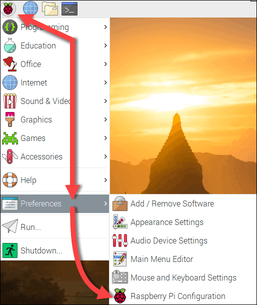

<p align="center">
  <a href="https://example.com/">
    
  </a>

  <h3 align="center">Logo</h3>

  <p align="center">
    Short description
    <br>
    <a href="https://reponame/issues/new?template=bug.md">Report bug</a>
    ·
    <a href="https://reponame/issues/new?template=feature.md&labels=feature">Request feature</a>
  </p>


# Dokumentation

- [Einleitung](#einleitung)
- [Aufgabenstellung](#aufgabenstellung)
- [Idee](#idee)
- [Projektziele](#projektziele)
- [Risikoanalyse](#risikoanalyse)
- [Meilensteine](#meilensteine)
- [Einrichtung und Konfiguration](#einrichtung-und-konfiguration)
- [Features](#features)
- [Technische Doku](#technische-doku)

- [Thanks](#thanks)
- [Copyright and license](#copyright-and-license)
- [Bugs and feature requests](#bugs-and-feature-requests)


## Einleitung

Diese Dokument dient als Projektdefinition für unsere Projekt Arbeit in Modul Projektarbeit. In diesem Dokument wir die Aufgabe erläutert, unsere Idee und die zu verwendeten Techologien erklärt. Ausserdem werden die Rahmenbedingungen erkläutert.

## Aufgabenstellung

Ziel ist es in eine Applikation in JAVA zur erstellen welches das Administeren von Discord Server vereinfacht.

## Idee


## Projektziele

Durch Automatisation und Implementation von Tasks und Features (Rollenverteilung, Channelmanagement) soll der Verwaltungsaufwand verringert werden.

Mit diesem Projekt sollen folgende Ziele erreicht werden:
- 1.	Automatisation von Rollenverteilung
- 2.	Individuelle Befehle (Ping - Pong)
- 3.	Aufbau der Infrastruktur für eine erweiterbare Lernumgebung

## Risikoanalyse

Schadensausmass
| | | | |
|:---|:---|---:|---:|
Schadensausmass| | | |
Hoch|-Discord stellt keine Dienste <br />mehr bereit <br />-Java wird nicht weiter<br /> unterstützt| |
Mittel| | |
Niedrig| |   |
| |Niedrig |Mittel |Hoch| 
||Eintrittswarscheinlichkeit| |

# Meilensteine

## Chart
| Meilenstein | Festgelegter Termin |Fertigstellung |
|-------------|----------------------|-------------------|
|Projektbeginn|29.04.2022|                   |
|Projektantrag Abgabe|06.05.2022|                   |
|Infrastruktur bereitgestellt|27.05.2022|30.07.2022                   |
|Projektabschluss|02.09.2022|                   |

## Termine

| Sitzungen |Termine | 
|----------------|----------------------|
|Projektsitzungen|03.06.2022, 29.08.2022|                   
|Präsentation|06.05.2022|                   

# Einrichtung und Konfiguration

## Raspberry PI Einrichtung

Für den Discord Bot benötigen wir einen Host. Wir haben uns hier für ein Raspberry PI entschieden, da dieses einfach zu warten ist und wenig Platz benötigt.<br />

Mit Hilfe von Raspberry PI Imager kann das gewünschte Betriebssystem installiert werden. Wir verwenden das PI OS 64-bit und schreiben dieses auf die Micro SD Karte.
Bei erfolgreichem schreiben des Betriebssystems können wir die SD Karte einsetzen und mit einem USB-C den Raspberry Pi Computer mit Strom versorgen.

## Raspberry Konfiguration

Mittels HDMI können wir den Desktop des Betriebssystem anzeigen lassen und die ersten Konfigurationen vornehmen. <br />

Mittels Setupmanager wählen wir als erstes die korrekte Region, Zeitzone und Sprache. Danach setzen wir ein Passwort sowie den Namen für den User. Wir benennen ihn nach unserem Projekt, also sugu. Wir benötigen den Namen und Passwort später, wenn wir via SSH darauf zugreifen wollen. <br />

Wir setzen den Haken für das Screen Setup um optimierte Auflösungen zu erhalten für den Bildschirm. Da wir Ethernet verwenden, müssen wir uns nicht mit einem W-LAN verbinden. <br />

Sobald wir mit einem Netzwerk verbunden sind, können wir im Setupmanager ein Update der Software durchführen.

## SSH einschalten
Um auf unseren User zugreifen zu können, müssen wir SSH aktivieren. Dafür klicken wir auf dem Desktop auf das Raspberry logo, wählen **Preferences** und dann **Raspberry PI Configuration**. Unter dem **Interfaces** Tab können wir SSH anwählen. 

  <br />

## Statische IP vergeben
Um mit keinen Komplikationen konfrontiert zu werden, vergeben wir dem Raspberry PI eine Statische IP Addresse. Dafür öffnen wir das Terminal auf dem Desktop. Mittels ``ifconfig`` können wir die momentan zugeweiste IP des netzwerkes ansehen. In unserem Fall ist dies **192.168.1.17**.<br />Mittels ``sudo nano /etc/dhcpcd.conf`` können wir direkt in die config file unsere gewünschte IP Addresse schreiben. Dies machen wir wiefolgt: 
```
interface eth0
static ip_address=192.168.1.17
static routers=192.168.1.1
static domain_name_servers=8.8.8.8 8.8.4.4

```
Einstellungen mit ``Ctrl + o`` schreiben und den Editor mit ``Ctrl + x`` verlassen. Danach den Raspi neustarten:

``sudo reboot``

## Docker Installation

Mit Docker ist es einfach, Server-Software auszuprobieren und zu betreiben. So installiert man die Container-Plattform für gängige Betriebssysteme auf dem Server oder Entwickler-PC, hier in unserem Fall das Raspberry PI

Da nun eine Statische IP gesetzt wurde, kann via SSH verbunden werden. Mittels dem Programm Putty auf 192.168.1.17 verbinden, Username und Passwort eingeben. <br />
Danach führen wir standart package updates aus, um auf dem neusten stand zu sein.

```
sudo apt update

sudo apt upgrade
```

Mit dem curl statement starten wir ein Shell Script, um Docker zu installieren: 

```
curl -sSL https://get.docker.com | sh
```
Als nächstes müssen wir den Benutzer ```sugu``` in die dockergruppe hinzufügen:
```
sudo usermod -aG docker sugu
```
## Docker testen
Nach der Installation von Docker und Docker-Compose kann man Programme schnell auf allen Betriebssystemen testen. Ob der Docker-Daemon läuft, verrät `docker version`.

Ob Docker-Compose läuft, verrät `docker compose version`.
## Portainer Installation
Um die Verwaltung der Container zu vereinfachen mit einem web GUI installieren wir Portainer. 
Portainer ist ein Open Source Werkzeug, um Container basierte Anwendungen unter Docker, Kubernetes, Docker Swarm und Azure ACI zu verwalten. Dabei stellt Portainer eine komfortable Benutzeroberfläche für das Management der Docker-Umgebung zur Verfügung.


```
sudo docker pull portainer/portainer-ce:linux-arm

sudo docker run -d -p 9000:9000 --name=portainer --restart=always -v /var/run/docker.sock:/var/run/docker.sock -v portainer_data:/data portainer/portainer-ce:linux-arm
```
Danach ist die Installation abgeschlossen. Nun können wir mit einem Browser Lokal auf das Webinterface zugreifen: ``http://sugu.local:9000/``

 


TODO mario: erklärung der Features, Beschreibung idee


# Features


## Rollenverteilung "Simp" Rolle


## Ping - Pong


## @Everyone Bot schutz und Jail rollenvergabe


## YEP chatbot


# Technische Doku

Unser Applikation ist in Java geschrieben. Als Buildsystem verweden wir Gradle damit wir die Java Applikation erstellen können.

Gielderung der Applikation:
TODO BILD HINZUFüGEN SYSTEMüBERSICHT
TODO BILD HINZUFüGEN SCHEMA
TODO BILD HINZUFüGEN KLASSEN DIAGRAM

Systemübersicht:
- [Discord API](#discord-API)
- [Raspberry PI / Server](#raspberry-pi-server)
- [Docker](#docker)
- [Applikation, Dependencies](#applikation)
- [Reflektion](#reflektion)


## Discord API
Wir verwenden die Discord API via der Java Biliothek discord4j.

### Risiken:

Sollte die Discord API down sein geht unser Bot natürlich nicht somit ist es ein single point of failure.

## Raspberry PI Server
Als Server verwenden wir einen Raspberry PI 4B 8 GB RAM.
### Vorteile:
Dieser hat den Vorteil wenig Ressourcen zu verbrauchen (Strom, Platz). Ideal Für unseren Use Case.
### Nachteile
Ein Nachteil kann sein, dass bestimmte Software nicht läuft, da es eine andere CPU Architecture hat.
Beim Raspberry PI ist es ein arm64v7.

Uns betrifft das nicht in diesem Fall, da unsere Java Applikation in einem Docker Container gehostet wird.

### Risiken:
1. Stromausfall: Sollte es einen Stromausfall geben, wird der Discord Bot ,abstürtzen da wir ihn nicht redudant hosten.
2. Internetausfall: Sollte <TODO MARIO ISP> ausfallen ist der Discord Bot auch nicht erreichbar.


## Docker
Wir verwenden docker als Container Technologie.
Ermöglicht uns einfaches Deployment von der Applikation. Wenn Die Applikation auf dem Container Läuft, kann der Discord Bot auf allen Docker lauffähigen PCs gehostet werden.
Zudem verwenden wir noch Docker Compose. Dieser Managed den Docker Container. Sollte dieser abstürtzen wird er neu gestartet. Dies Ermöglicht es uns eine hohe Uptime zu gewäreleisten.

### Vorteile:
Abgestürzte Container werden neu gestartet.
### Nachteile / Risiken:
Wir haben eine zusätzliche Abhänigkeit welche wir managen müssen.


## Applikation
Unser Discord Bot ist in Java geschrieben. Wir verwenden als biliothek discord4j, welche uns eine einfache integration mit Discord ermöglicht.
### Vorteile:
Java ist eine einfach zu lernende Sprache. Weiter gibt es schon viele Biliotheken, welche wir einbinden können.
### Nachteile / Risiken:
Wir haben eine direkte Abhängigkeit zu discord4j. Sollte die Biliothek nicht mehr gewartet werden, müssten wir Anspassungen selbst implentieren.

## VCS
Als VCS haben wir die Vorgabe Git

### Vorgehen beim Programmieren

Wir haben uns dazu entschieden die Applikation in Pair Programming zu erstellen. Somit haben wir einen direkten Austausch von Ideen, wie wir unser gewünschtes Feature umsetzen können.
Der Vorteil dabei ist, dass wir beide den Code kennen und diesen einfach warten können.


```Filesystem
main/
└── Java/
      └── ch.wema/
            ├── commands/
            │        └── PingCommand
            ├── core/
            │    ├── command/
            │           └── Command
            │    └──reaction/
            │           └── Reaction
            ├── event.listeners/
            │           ├── ChatInpitInteractionEventListener
            │           ├── MessageCreateEventListener
            │           └── VoiceStateUpdateEventListener
            └──  reactions/
                  │     ├── AddEveryoneReaction
                  │     ├── SimpReaction
                  │     └── YepReaction
                  ├── GlobalCommandRegistrar
                  └── Sugu
 
```


Folgende 4 Teile sind die wichtigsten:

1. Commands
2. Reactions
3. Listeners
4. GlobalCommandRegistrar


#### Commands:

Commands oder auch Befehle sind alle Befehle welcher der Benutzer kontrolliert absetzen kann.<br />
Diese unterleidung dient zur seperierung von Klassen und dient der einfachen Übersicht.

#### Reactions:

Eine Reaction ist ein Event, auf welches man Reagieren möchte bsp. Statusänderung von Usern.

#### Listeners:

Listeners handeln alle Events von Reactions und Commands.

#### GlobalCommandRegistrar:
Dient Regestierung von Events auf der Server Seite.


#### Gliederungsvorteile

Anpassungen sind einfach zu erstellen, da man diese als Command oder als Reaction einfach hinzufügen kann und keinen bestehenden Code anpassen muss.
Der der Core Ordner dient als Abstraction damit alle Reactions/Commands einen gleichen nenner haben ausserhalb des Objektes.

## Reflektion

#### Was ist gut geganen: TODO

#### Wo haben wir noch verbessung potenzial: TODO

#### Offne Punkte: TODO

#### Aussicht: TODO


## What's included (:)

Some text

```text
folder1/
└── folder2/
    ├── folder3/
    │   ├── file1
    │   └── file2
    └── folder4/
        ├── file3
        └── file4
```

## Bugs and feature requests

Have a bug or a feature request? Please first read the [issue guidelines](https://reponame/blob/master/CONTRIBUTING.md) and search for existing and closed issues. If your problem or idea is not addressed yet, [please open a new issue](https://reponame/issues/new).

## Contributing

Please read through our [contributing guidelines](https://reponame/blob/master/CONTRIBUTING.md). Included are directions for opening issues, coding standards, and notes on development.

Moreover, all HTML and CSS should conform to the [Code Guide](https://github.com/mdo/code-guide), maintained by [Main author](https://github.com/usernamemainauthor).

Editor preferences are available in the [editor config](https://reponame/blob/master/.editorconfig) for easy use in common text editors. Read more and download plugins at <https://editorconfig.org/>.

## Creators

**Creator 1**

- <https://github.com/usernamecreator1>

## Thanks

Some Text

## Copyright and license

Code and documentation copyright 2011-2018 the authors. Code released under the [MIT License](https://reponame/blob/master/LICENSE).

Enjoy :metal: